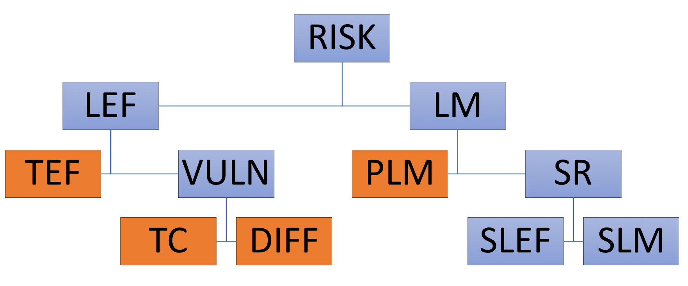

## Exercise 1 - Identify the OpenFAIR factors

```{r setup, message=FALSE, warning=FALSE}
library(tidyverse)
library(evaluator)
```

```{r echo=FALSE, fig.cap="OpenFAIR ontology", out.width = '100%'}

```


```{r}
my_scen <- tidyrisk_scenario(
        tef_params = list(min = 1, mode = 10, max = 100, shape = 3, func = "mc2d::rpert"),
        tc_params = list(min = .20, mode = .30, max = .70, shape = 2, func = "mc2d::rpert"),
        diff_params = list(list(min = .25, mode = .50, max = .60, shape = 3, func = "mc2d::rpert")),
        lm_params = list(min = 100, mode = 1000, max = 10000, shape = 3, func = "mc2d::rpert"))

my_results <- run_simulation(my_scen, iterations = 1000)

```

